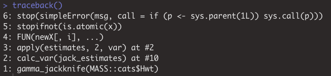
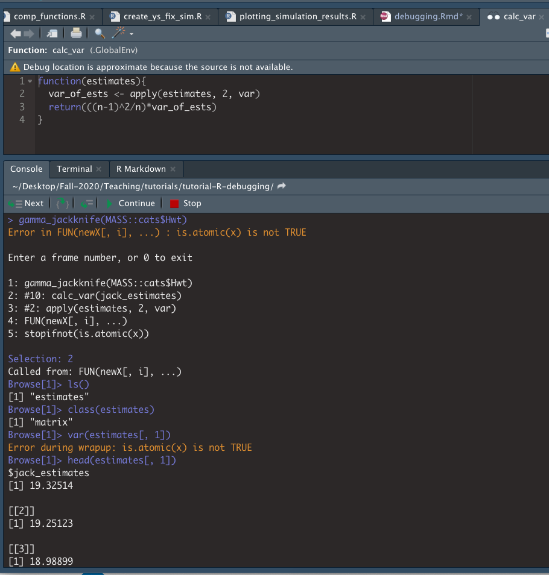
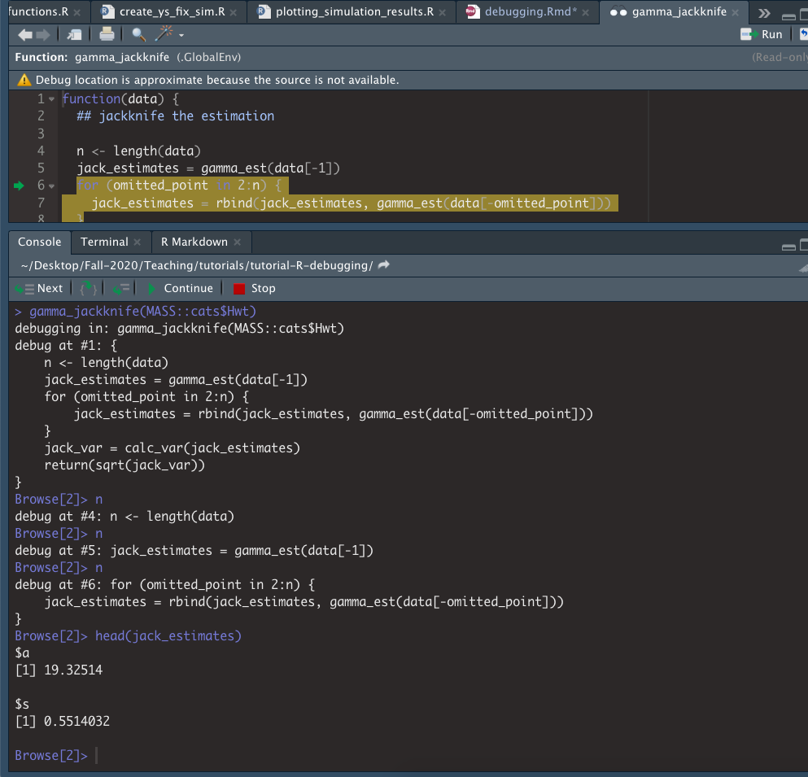

```{r setup, include=FALSE}
knitr::opts_chunk$set(echo = TRUE)
```

# Useful links
- General advice for debugging
    - [Efficient Debugging by Goldspink](https://www.codementor.io/mattgoldspink/how-to-debug-code-efficiently-and-effectively-du107u9jh)
    - [Debugging for Beginners by Brody](https://blog.hartleybrody.com/debugging-code-beginner/)
- R specific debugging
    - [Advanced R by Wickham](https://adv-r.hadley.nz/debugging.html)
    - [Debugging in Rstudio by Gadrow](https://rstudio.com/resources/videos/debugging-techniques/)
- The material for this document is based on the SCF tutorial linked below.  
    - [Berkeley-SCF tutorial by Chris Paciorek](https://github.com/berkeley-scf/tutorial-R-debugging) 
    - [Debugging demo by Chris](https://www.youtube.com/watch?v=-yy_3htRHdU&feature=youtu.be&ab_channel=berkeley-scf)

# Learning objectives 
The goal for this section is to become familiar with the debugging tools available in R as well as provide additional information on online forums and common errors in R.  Note that the debugging tools in R are difficult to illustrate in a Rmd document, so I recommend watching this   [screencast](https://www.youtube.com/watch?v=-yy_3htRHdU&feature=youtu.be&ab_channel=berkeley-scf) from the SCF tutorial.  I will also do a live demo at the beginning of section if that you all would find that useful.  

Also, note that the material in this PDF is a summary of SCF tutorial on debugging, so if you want to see more detail please visit the [tutorial GitHub](https://github.com/berkeley-scf/tutorial-R-debugging).  The tutorial also has some good tips for defensive programming that you may find useful for preventing and catching errors in your code.

# `R`'s debugging tools
Below is a list of the debugging tools available in R.  I took screenshots illustrating how some of the tools work in R Studio in the example below. 

##  Tools
- Use `traceback` to view the call stack, which can help pinpoint where an error is occurring.
- Use `recover`  to navigate the stack of active function calls at the time of the error and browse within the desired call. If you set `options(error = recover)` then `recover` is invoked whenever an error occurs.  You can revert the options to the default with `options(error = NULL)`.
- `browser()`: pauses current execution, provides an interactive interpreter. 
You can now step through a function line-by-line to find errors.
- `debug(someFunc)`: sets a `browser()` statement at the first line of `someFunc` 
    - `undebug(someFunc)` removes the `debug()` statement. Or close the `R` session
    - `debugonce(someFunc)` lets you debug only once, no need to run `undebug()`
- `trace()`: allows you to temporarily modify a function without saving the modifications
    - Edits will be removed when session ends 
    - Alternatively, you can use `untrace()` to remove temporary edits. 

## Example of debugging
We will use the `jackKnife.R` code to understand the debugging tools.  
```{r, eval=FALSE}
library(MASS)

gamma_est <- function(data) {
  # this fits a gamma distribution to a collection of numbers
  m <- mean(data)
  v <- var(data)
  s <- v/m
  a <- m/s
  return(list(a=a,s=s))
}

calc_var <- function(estimates){
  var_of_ests <- apply(estimates, 2, var)
  return(((n-1)^2/n)*var_of_ests)
}

gamma_jackknife <- function(data) {
  ## jackknife the estimation
  
  n <- length(data)
  jack_estimates = gamma_est(data[-1])
  for (omitted_point in 2:n) {
    jack_estimates = rbind(jack_estimates, gamma_est(data[-omitted_point]))
  }
  
  jack_var = calc_var(jack_estimates)
  
  return(sqrt(jack_var))
}

# jackknife gamma dist. estimates of cat heart weights
gamma_jackknife(MASS::cats$Hwt) 
```
Notice that there is an error returned by the function, but it is unclear what is producing the error.  We can start by calling `traceback()` to see what may have gone wrong.  

{width=95%}

`traceback()` shows us the set of calls leading up to the error.  We see that the error is produced at 5, and thus came from the call at 4 `FUN(newX[, i], ...)` which occured after calling `calc_var()` function and attempting to excecute the `apply` statement.

An alternative to `traceback()` is `recover()`.  If we have set `options(error = recover)` and call
`gamma_jackknife(MASS::cats$Hwt)` again we will see the call stack (in reverse order of `traceback`), but now we have the option to select a number in the stack that we would like to enter.  I selected 2 and entered the `calc_var` function.  Typing `ls()` showed me that the only object in the function environment is `estimates`, which is a matrix.  However, I see the `is.atomic(x)` error when I try to compute the variance of a column. When we look at the column, we can now see that we output a list, instead of a vector and we know exactly where the error is occuring.  To exit we type `Q` and hit enter.  

{width=95%}

Now let's say we want to browse in the `gamma_jackknife()` function to figure out why we are passing a list to `calc_var` we can utlize the `debug()` function, which will allow us to step through `gamma_jackknife` one line at a time.  We first call `debug(gamma_jackknife)` and then when we attempt to run `gamma_jackknife(MASS::cats$Hwt)`, because an error is produce, we will enter the browser mode.  

{width=95%}

We can use the graphical interface in R Studio or the command line, with the command `n` to step through lines of the code and see what it outputs.  Here we see that `gamma_est` is returning a list and that is likely the source of our issues.  

For more details on these functions, as well as how to use `trace` to temporarialy add edits see the SCF tutorial and the screencast.  Also, as I stated above if there is enough interest I can do a live demo at the beginning of section.  

# Common errors    

- Parenthesis mis-matches
- `[[...]]` vs. `[...]` 
    ```{r}
    # example list
    myList <- list("A"=1:10,
                   "B"=11:20)
    
    # one set
    cat("Type: ", typeof(myList[1]), "\nLength: ", length(myList[1]), sep = "")
    
    # two sets
    cat("Type: ", typeof(myList[[1]]), "\nLength: ", length(myList[[1]]), sep = "")
    ```
- `==` vs. `=` 
- Comparing real numbers exactly using `==` is dangerous because numbers on a 
computer are only represented to limited numerical precision. 
    ```{r}
    # exact comparison
    1/3 == 4*(4/12 - 3/12)
    
    # approximate comparison
    #  default tolerance is sqrt(.Machine$double.eps)
    all.equal(target = 1/3 ,current = 4*(4/12 - 3/12))
    ```
- You expect a single value but execution of the code gives a vector
- You want to compare an entire vector but your code just compares the first value 
(e.g., in an if statement) 
    - consider using `identical()` or `all.equal()`
    ```{r}
    x <- 1:10 
    y <- 1:5
    if (x == y) {
      print("Equal")
    }else {
      print("Not equal")
    }
    
    if (identical(x, y)) {
      print("Equal")
    }else {
      print("Not equal")
    }
    ```
- Silent type conversion when you don't want it, or lack of coercion where you're expecting it
    - eg., `read.csv()` and the `stringsAsFactors` argument 
- Using the wrong function or variable name
- Giving unnamed arguments to a function in the wrong order 
- In an if-else statement, the `else` cannot be on its own line (unless all the code is enclosed in `{}`) 
because R will see the `if` part of the statement, which is a valid R statement, 
will execute that, and then will encounter the `else` and return an error.
- Forgetting to define a variable in the environment of a function and having R, 
via lexical scoping, get that variable as a global variable from one of the enclosing 
environments. At best the types are not compatible and you get an error; at worst, 
you use a garbage value and the bug is hard to trace. In some cases your code may 
work fine when you develop the code (if the variable exists in the enclosing environment), 
but then may not work when you restart R if the variable no longer exists or is different.
    - Clear your environment before testing (`rm(list=ls());gc()`)
    - Restart `R` session and test
- R (usually helpfully) drops matrix and array dimensions that are extraneous. 
This can sometimes confuse later code that expects an object of a certain dimension. 
    ```{r}
    # 3x3 matrix
    myMat <- matrix(data = 1:9, nrow = 3, ncol = 3)
    
    # lost dimensions
    dim(myMat[1, ])
    
    # keep dimensions
    dim(myMat[1, , drop = FALSE])
    ```


# Getting help online

## Online forums / mailing lists

There are online forums that have lots of useful postings. 
In general if you have an error, others have already posted about it.

- Simple web searches - *a la Google*
    - You may want to include "in R" or preface your question with "R yada yada yada"
- [Stack overflow](http://stackoverflow.com): R stuff will be tagged with 'R'
    - [http://stackoverflow.com/questions/tagged/r](http://stackoverflow.com/questions/tagged/r)
- R help special interest groups (SIG) such as r-sig-hpc (high performance computing), 
r-sig-mac (R on Macs), etc.
    - To search a SIG you might include the name of the SIG in the search string 
- [Rseek.org](http://Rseek.org) for web searches restricted to sites that have information on R
- R help: [R mailing lists archive](http://tolstoy.newcastle.edu.au/R)

Note: of course these are also helpful for figuring out how 
to do things, not just for fixing bugs. For example, this [blog post](http://www.r-bloggers.com/the-guerilla-guide-to-r/?utm_source=feedburner&utm_medium=email&utm_campaign=Feed%3A+RBloggers+%28R+bloggers%29) has a guide to R based simply on Stack Overflow posts. 

## Asking questions online

If you've searched the archive and haven't found an answer to your problem, you 
can often get help by posting to the R-help mailing list or one of the other 
lists mentioned above. A few guidelines (generally relevant when posting to mailing 
lists beyond just the R lists):

- Search the archives and look through relevant R books or manuals first.
    - [Advanced R](http://adv-r.had.co.nz/) by Hadley Wickham
- Boil your problem down to the essence of the problem, giving an example,
including the output and error message
    - My first [SO](https://stackoverflow.com/questions/49822833/r-package-call-c-function-within-rcpp) post
        - Notice the not-so-polite comments, see the remark below
    - My second [SO](https://stackoverflow.com/questions/56298503/r-vignette-fails-on-internal-package-function) question
- Say what version of R, what operating system and what operating system version you're using. 
    - Provide `sessionInfo()` and `Sys.info()`. These show the current state of your machine
- Read the [R mailing list posting guide](https://www.r-project.org/posting-guide.html).

The R mailing lists are a way to get free advice from the experts, who include 
some of the world's most knowledgeable R experts - seriously - members of the R 
core development team contribute frequently. The cost is that you should do your 
homework and that sometimes the responses you get __may be blunt__, along the lines 
of “read the [manual](https://cran.r-project.org/manuals.html)”. Chris considers it a 
pretty good tradeoff - where else do you get the foremost experts in a domain actually helping you?

# Group problem for section: `logitBoot()`
For the group work this week we will step through debugging the `logitBoot` function.  This is a function that computes a bootstrapped estimate of the standard error of the coefficient on a logistic regression model.  From R's implementation of logistic regression, stored in the `mod` variable, we can see that the estimated standard error is around 3.  However, by calling `logitBoot(my_data$y, my_data$x)`, which is supposed to get this same standard error, we return a value of over 100.  

The goal here is to figure out what is going wrong and, if time, fix the issue.  Below are a list of steps you can take reach this goal.  Note, that the functions are in the `logitBoot.R` script, so it will easiest to open that file and work from there.

  - Load `data.csv` and look at the data to see what we are working with.   There should be a column of `y` values (which are 0 or 1) and a column of `x` values (which are continuous).
    - The goal of logistic regression is to model which class `y` (0 or 1) an observation falls in based on `x`.
  - Load the functions in the `logitBoot.R` script. 
  - Fit the logistic regression model in R using the `glm` function (code provided) and look at the `summary(mod)`
    - Notice the estimated standard error on the coefficient for `x` is around 3. 
  - Try to run the `logitBoot(my_data$y, my_data$x)`.  Notice the overestimate and the warning.  We want to figure out what is going wrong.
  - Call `debug(logitBoot)` and rerun `logitBoot(my_data$y, my_data$x)`.  This will take you into the browser window for `logitBoot` (if you get a fatal error at this step, you may need to update RStudio)
    - Run through each line until you compute the vector `boot_coefs`.  Use the `range` and `quantile` functions to examine `boot_coefs` and see what could be going wrong.
    - Find the index of sample that is causing the issue.
  - Now that we have identified where the issue is occuring we still need to figure out why that paricular permutation is problematic.  For that we will use `trace` to temporarily edit our functions.
    - Call `trace(myGLM, edit = TRUE)` and edit the function to return a list of coeficient, `y_boot`, and `x_boot`.
    - Call `trace(logitBoot, edit = TRUE)` and change `sapply` to `lapply` 
  - Rerun `logitBoot(my_data$y, my_data$x)`, which will again open the browser window. Step through the code lines and look at `boot_coefs[[i]]` where `i` is the index found in step 5.
    - Look at the values of `x_boot` that correspond to `y_boot = 1`.  Also, `sort` the `x_boot` output.  Can you tell what is going wrong? 
  - Now that we know what is causing the warning we can call `untrace(logitBoot)` and `untrace(myGLM)` to remove the temporary edits.  

After identifing the issue and we could edit the `myGLM` function to not compute the model when that particular issue arises.  Alternatively, we could employ a more holistic approach with `tryCatch`.  With this we can handle unforseen issues that may arise.  This is what is implemented in the `jackKnife_solution.R` script.  Note, with the fixed code we now seem to underestimating the standard error.  I am not sure why that is happening... because as far as I can tell the code is working correctly. 

```{r, eval=FALSE}
my_data <- read.csv('./data.csv')

logitBoot <- function(y, x, n_boot = 2000) {
  set.seed(5)
  
  # do n_boot random permutations of x and y and return coefficient on x with 
  # the myGLM function
  boot_coefs <- sapply(seq_len(n_boot), myGLM, y, x)
  
  # compute standard deviation of those estimates and return
  boot_se <- sd(boot_coefs)
  return(boot_se)
}

myGLM <- function(i, y, x) {
  n <- length(y)
  
  # randomly sample with replacement from the observations in the data
  boot_sample <- sample(seq_len(n), n, replace = TRUE)
  
  # create vectors of the bootstrapped samples
  x_boot <- x[boot_sample]
  y_boot <- y[boot_sample]
  
  # fit logistic regression on permutated data
  mod_boot <- glm(y_boot ~ x_boot, family = 'binomial')
  
  # return the estimated coefficient
  return(mod_boot$coef[2])
}

# fit model in R
mod <- glm(y ~ x, data = my_data, family = 'binomial')

# note that the standard error for the regression coefficient is ~3
summary(mod)

# estimate standard error with our bootstrap function
# note the overestimation of standard error 119 > 3
logitBoot(my_data$y, my_data$x)
```


